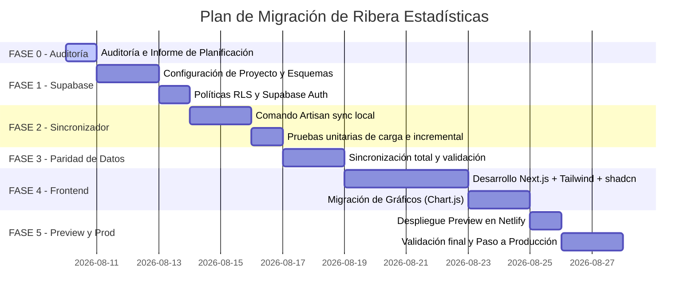

# Plan de Implementación: Publicación del Panel de Estadísticas en Netlify + Supabase

Este documento detalla la auditoría de la aplicación actual y define la estrategia técnica y el plan de migración para convertir la aplicación en una solución web serverless de solo lectura en Next.js alojada en Netlify, utilizando Supabase (PostgreSQL + Auth + RLS) como base de datos de reporting.

---

## A. Estado Actual (Auditoría Técnica)

### 1. Arquitectura Encontrada y Versiones
*   **Backend actual**: Laravel 13.7.0 corriendo en PHP 8.4.24 (bajo WampServer local, Apache/2.4.51 en el puerto `8080`).
*   **Base de datos ERP**: SQL Server (`INTEGRAL`) alojada en la red local (`192.168.1.215` / `192.168.200.105`). La conexión se realiza a través de `pdo_sqlsrv`.
*   **Base de datos Local**: MySQL 8 (`ribera_estadisticas`) configurada como réplica/espejo mediante migraciones locales, actualmente vacía (0 registros).
*   **Frontend actual**: Laravel Blade templates, Tailwind CSS y gráficos con Chart.js.
*   **Dependencias principales** (`composer.json`):
    *   `laravel/framework`: `^13.0`
    *   `maatwebsite/excel`: `^3.1` (para importaciones Excel y exportaciones de informes)
    *   `markrogoyski/math-php`: `^2.13` (cálculos estadísticos y matemáticos)

### 2. Configuración y Conexiones (.env)
Las variables de entorno que controlan la conexión al ERP y la URL local son:
*   `APP_URL=http://localhost:8080/ribera-estadisticas/public/index.php`
*   `ERP_DB_HOST=192.168.1.215\\INTEGRAL`
*   `ERP_DB_PORT=`
*   `ERP_DB_DATABASE=INTEGRAL`
*   `ERP_DB_USERNAME=vc`
*   `ERP_DB_PASSWORD=********`
*   `ERP_DB_ENCRYPT=no`
*   `ERP_DB_TRUST_SERVER_CERTIFICATE=true`

### 3. Estructura de Datos y Sincronizadores en el Repositorio
*   **Comandos Artisan existentes** (`app/Console/Commands/`):
    *   `app:import-erp-all`: Ejecuta de forma secuencial los importadores individuales.
    *   `app:import-erp-clients`, `app:import-erp-products`, `app:import-erp-sales`, `app:import-erp-sale-lines`, `app:import-erp-invoices`, `app:import-erp-stock`, `app:import-erp-stock-movements`, `app:import-erp-families`, etc.
    *   *Nota*: Estos comandos realizan un `upsert` por lotes (chunk de 1000) desde SQL Server hacia las tablas locales de MySQL (`erp_sales`, `erp_products`, etc.), manteniendo claves naturales como llaves primarias.

---

## B. Inventario de Datos por Pantalla y Consultas

A continuación se mapea la relación entre las pantallas actuales, sus consultas SQL asociadas, y las tablas del ERP que se consumen.

### 1. Cuadro de Mando General (DashboardController)
*   **KPIs principales**: Ventas totales, número de pedidos, ticket medio, importe pendiente y clientes únicos del período.
    *   *Origen SQL Server*: `hist_ventas_cabecera v`
    *   *Filtro*: `tipo_venta IN (2,4,5)` (Facturas), fecha en curso, no anuladas (`anulada <> 'S'`).
*   **Ventas por mes (año actual vs año anterior)**:
    *   *Origen SQL Server*: `hist_ventas_cabecera v` agrupado por `YEAR` y `MONTH`.
*   **Top 10 Clientes**:
    *   *Origen SQL Server*: `hist_ventas_cabecera v` LEFT JOIN `clientes c`. Agrupado por cliente, ordenado por total gastado descendente.
*   **Top 10 Productos con Stock**:
    *   *Origen SQL Server*: `hist_ventas_linea l` INNER JOIN `hist_ventas_cabecera v` LEFT JOIN `articulos a` LEFT JOIN `stocks s`. Agrupado por artículo, calculando ingresos y existencias actuales.
*   **Desgloses**: Ventas por Familia (`familias`), Ventas por Almacén (`hist_ventas_cabecera`), Top Vendedores (`hist_ventas_cabecera`).

### 2. Ventas y Pedidos (OrderController)
*   **Listado de Facturas / Albaranes**: Listado paginado con ordenación dinámica y búsqueda por texto (cliente/razón social).
    *   *Origen SQL Server*: `hist_ventas_cabecera v` (usando `OFFSET ? ROWS FETCH NEXT ? ROWS ONLY`).
*   **Líneas de Venta (Detalle modal AJAX)**:
    *   *Origen SQL Server*: `hist_ventas_linea l` filtrando por `cod_venta`, `tipo_venta`, `cod_empresa`, `cod_caja`.
*   **Filtros maestros**: Listado dinámico de almacenes, vendedores, tipos de venta y formas de pago a partir de los datos históricos.

### 3. Stock y Productos (ProductController)
*   **Listado de Inventario**: Listado paginado de artículos con existencias, mínimos, precio de coste y venta.
    *   *Origen SQL Server*: `articulos a` LEFT JOIN `stocks s` (agrupando existencias de todos los almacenes) LEFT JOIN `familias` y `subfamilias`.
*   **KPIs de Stock**: Valor total del inventario (existencias * coste), productos bajo mínimo (`existencias < stock_minimo`), artículos obsoletos o sin movimiento.

### 4. Clientes (ClientController)
*   **Listado de Clientes y Deudas**:
    *   *Origen MySQL Local* (en la app actual): Lee de `erp_clients c` LEFT JOIN `erp_sellers s` y subconsulta de sumario de facturas en `erp_sales`.
    *   *Datos expuestos*: Razón social, CIF, población, provincia, límite de crédito y ventas acumuladas.

### 5. Proveedores (SupplierController)
*   **Directorio de Proveedores**:
    *   *Origen MySQL Local*: Lee de `erp_suppliers`. Muestra CIF, población, provincia, teléfono y crédito otorgado.

### 6. Análisis Financiero (FinancialController)
*   **Márgenes y Beneficio Bruto**:
    *   *Origen SQL Server*: `hist_ventas_linea l` INNER JOIN `hist_ventas_cabecera v`. Calcula `revenue` (importe impuestos), `total_cost` (precio_coste * cantidad) y `gross_profit` (ingreso - coste).
    *   *Filtro de saneamiento*: Excluye códigos no inventariables como 'ALMACEN', 'FERRETERIA', etc., y costes nulos o negativos.
*   **Top Rentabilidad**: Márgenes detallados agrupados por Familia, Subfamilia y ranking de Productos Estrella.
*   **Evolución Temporal**: Histórico de beneficio y margen mensual.

### 7. Panel de Tienda / Sucursales (StoreDashboardController)
*   **Ventas en periodos dinámicos**: Compara Ventas de Hoy (último día registrado), Ayer (penúltimo día), Quincena actual vs Quincena anterior, y Año actual vs Año anterior, todo desglosado por Almacén.
    *   *Origen SQL Server*: `hist_ventas_cabecera`.
*   **Vencimientos, Impagados y Compras**:
    *   *Origen SQL Server*: Análisis de vencimientos pendientes de cobro y facturas de compras de proveedores para control de tesorería de la sucursal.

---

## C. Modelo Supabase Propuesto (Base de Datos de Reporting)

Para maximizar el rendimiento en Netlify (Serverless) y evitar la transferencia inútil de gigabytes de datos históricos del ERP, Supabase almacenará únicamente tablas optimizadas para el panel de control. 

```mermaid
erDiagram
    sync_status {
        uuid id PK
        timestamp started_at
        timestamp completed_at
        string status
        int records_processed
        string error_message
    }
    stats_kpis {
        string period_key PK "e.g., 2026-hoy, 2026-quincena"
        decimal total_sales
        int total_orders
        decimal avg_ticket
        decimal pending_amount
        int unique_clients
        decimal total_cost
        decimal gross_profit
        timestamp updated_at
    }
    stats_sales_monthly {
        int year PK
        int month PK
        decimal revenue
        decimal total_cost
        decimal gross_profit
        int orders_count
    }
    stats_warehouses {
        string cod_almacen PK
        string period_key PK
        int orders_count
        decimal total_sales
    }
    stats_sellers {
        string cod_vendedor PK
        string nombre_vendedor
        string period_key PK
        int orders_count
        decimal total_sales
    }
    sales_headers {
        string cod_venta PK
        int tipo_venta PK
        string cod_empresa PK
        string cod_caja PK
        string cod_almacen
        string cod_cliente
        string razon_social
        timestamp fecha_venta
        string cod_forma_liquidacion
        string cod_vendedor
        string nombre_vendedor
        decimal total_amount
        decimal pending_amount
        boolean anulada
    }
    sales_lines {
        string cod_venta PK
        int tipo_venta PK
        string cod_empresa PK
        string cod_caja PK
        int linea PK
        string cod_articulo
        string descripcion
        decimal cantidad
        decimal precio
        decimal precio_coste
        decimal total_amount
    }
    products_stock {
        string cod_articulo PK
        string descripcion
        string marca
        string cod_familia
        string cod_subfamilia
        decimal stock_total
        decimal stock_minimo
        decimal precio_coste
        decimal precio_venta
        timestamp updated_at
    }
    clients_reporting {
        string cod_cliente PK
        string razon_social
        string cif
        string poblacion
        string provincia
        string telefono
        string e_mail
        decimal limite_credito
        string cod_vendedor
        decimal total_spent
        int order_count
    }
    suppliers_reporting {
        string cod_proveedor PK
        string razon_social
        string cif
        string poblacion
        string provincia
        string telefono
        string e_mail
        decimal credito_otorgado
    }
    families_reporting {
        string cod_familia PK
        string descripcion
    }
    subfamilies_reporting {
        string cod_familia PK
        string cod_subfamilia PK
        string descripcion
    }
```

### Detalle de Tablas Propuestas

1.  **`sync_status`**: Control de las ejecuciones del sincronizador local.
2.  **`stats_kpis`**: Caché de KPIs precalculados para periodos comunes (Hoy, Quincena, Año en curso). Evita procesar millones de registros en tiempo real en Next.js.
3.  **`stats_sales_monthly`**: Agregados mensuales históricos de facturación, costes y márgenes para el gráfico comparativo interanual.
4.  **`stats_warehouses`** y **`stats_sellers`**: Sumarios de rendimiento de almacenes y vendedores por periodo.
5.  **`sales_headers`** y **`sales_lines`**: Cabeceras y líneas de venta detalladas únicamente para el rango de fechas relevante (año actual y año anterior). Permite búsquedas, paginación y drill-down en la pantalla de Ventas.
6.  **`products_stock`**: Catálogo de productos con su stock total consolidado y valores económicos.
7.  **`clients_reporting`** y **`suppliers_reporting`**: Directorios simplificados de clientes y proveedores con KPIs de negocio (gasto acumulado, deuda).
8.  **`families_reporting`** y **`subfamilies_reporting`**: Tablas maestras de categorías.

---

## D. Sincronizador Local (Laravel/PHP en local)

Reutilizaremos la estructura actual de Laravel en local (que ya resuelve la instalación del controlador `pdo_sqlsrv` y la autenticación interna con el ERP de Ribera) para crear un comando Artisan consolidado: `php artisan ribera:sync-to-supabase`.

### Estrategia de Sincronización y Criterios
*   **Idempotencia**: Se utilizará la estrategia de **UPSERT** basada en las llaves primarias naturales de los registros (ej. `cod_cliente` para clientes; `[cod_venta, tipo_venta, cod_empresa, cod_caja]` para ventas).
*   **Sincronización Incremental (Ventas)**: Las ventas anteriores al mes en curso se consideran históricas y no cambian. El sincronizador consultará en SQL Server únicamente las ventas con `fecha_venta >= primer_dia_del_mes_actual` y realizará un UPSERT en Supabase.
*   **Sincronización por Reemplazo Completo (Tablas Maestras pequeñas)**: Tablas de tamaño reducido como `familias`, `subfamilias`, `almacenes`, `vendedores` y `stats_kpis` se truncarán o sobrescribirán por completo en cada ejecución para garantizar consistencia absoluta.
*   **Transaccionalidad**: La actualización de estadísticas críticas se realizará dentro de una transacción en Supabase para evitar estados intermedios inconsistentes si falla la red.
*   **Frecuencia**:
    *   **KPIs, Ventas del mes y Stocks**: Cada 30 minutos (durante el horario comercial).
    *   **Clientes, Proveedores e Histórico mensual**: Una vez al día (por la noche).

---

## E. Frontend Next.js (Netlify)

La interfaz se migrará a Next.js (App Router) con TypeScript, estilada con Tailwind CSS y componentes accesibles de shadcn/ui.

### 1. Páginas y Rutas Propuestas
*   `/login`: Pantalla de acceso mediante Supabase Auth.
*   `/` / `/dashboard`: Panel general con KPIs, alertas de stock e impagos, y evolución de ventas.
*   `/sales`: Listado paginado de facturas con filtros interactivos, modal de líneas (consumiendo la API de Supabase) y exportador a CSV.
*   `/stock`: Monitor de existencias y valoración económica con filtro de mínimos y búsqueda.
*   `/clients`: Listado de clientes, límites de crédito y volumen de compra.
*   `/suppliers`: Directorio de proveedores.
*   `/financial`: Dashboard de control de márgenes, coste de mercancía vendida y rentabilidad por categorías.
*   `/store-dashboard`: Control sucursal por sucursal.

### 2. Librería de Gráficos
Se mantendrá **Chart.js** (utilizando el wrapper `react-chartjs-2`) para garantizar la paridad visual con la aplicación local actual sin alterar la forma en la que dirección interpreta las gráficas de evolución.

### 3. Estados de Carga e Interfaz
*   Se implementarán **Skeletons** en Tailwind para evitar saltos visuales durante la carga de KPIs y gráficos.
*   En la barra superior del panel se mostrará: `"Última actualización: [Fecha/Hora de sync_status]"`. Si la sincronización lleva más de 2 horas sin completarse, se mostrará un aviso de advertencia sin bloquear el acceso a los datos disponibles.

---

## F. Seguridad (Supabase Auth & RLS)

*   **Autenticación**: Supabase Auth controlará el acceso. No se admitirán accesos anónimos.
*   **Seguridad de Base de Datos (RLS)**:
    *   Se habilitará RLS (*Row Level Security*) en todas las tablas de Supabase.
    *   Se configurarán políticas de lectura (`SELECT`) restrictivas de modo que únicamente los usuarios autenticados (`auth.role() = 'authenticated'`) puedan consultar la base de datos de estadísticas.
    *   Se bloquearán por completo las operaciones de escritura (`INSERT`, `UPDATE`, `DELETE`) para el rol público y autenticado de cliente. Únicamente la cuenta de servicio local (sincronizador con `service_role`) tendrá privilegios de escritura.

---

## G. Plan de Implementación por Fases

---

## H. Plan de Validación y Pruebas de Regresión

Antes de dar el proyecto por concluido y apagar la versión local, se realizarán las siguientes comprobaciones:
1.  **Cuadre de Cifras**: Se ejecutará un script de comparación automática que contrastará los resultados de 5 consultas agregadas clave (Facturación mensual, Margen por Familia, Clientes Activos, Productos bajo Mínimo y Venta por Comercial) entre SQL Server y Supabase. La tolerancia de desviación permitida es **0.00%**.
2.  **Pruebas de Fallo**: Se desconectará intencionadamente el sincronizador de Internet para comprobar que Supabase conserva los datos de la última sincronización correcta y el frontend muestra el aviso de "actualización retrasada" sin romperse.
3.  **Typecheck & Build**: Ejecución de `npm run build` en Next.js con TypeScript estricto habilitado para asegurar la inexistencia de errores de tipado o imports rotos.
